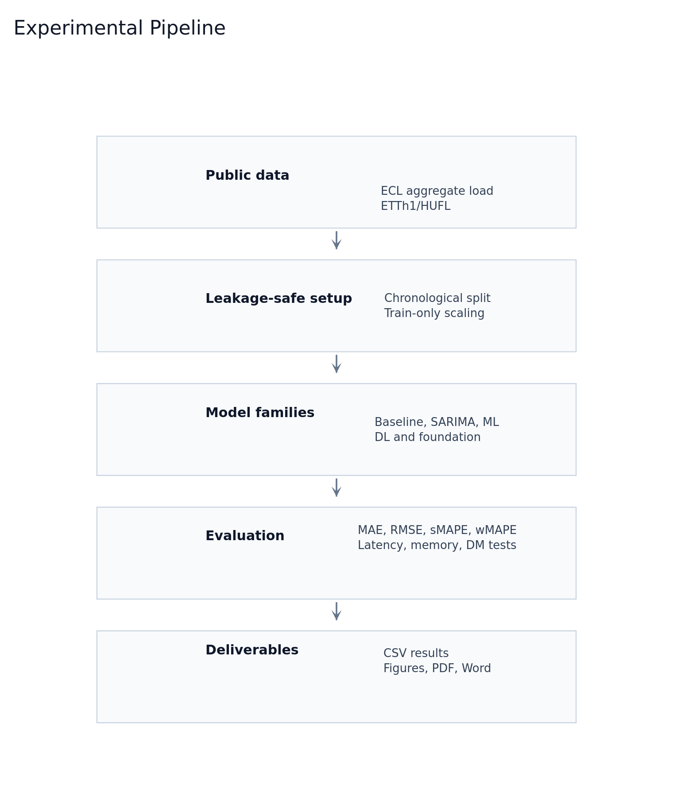
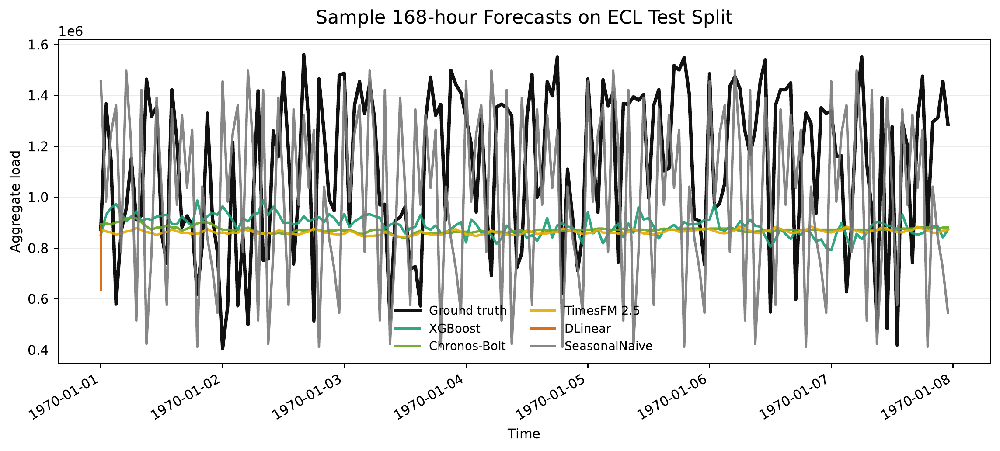
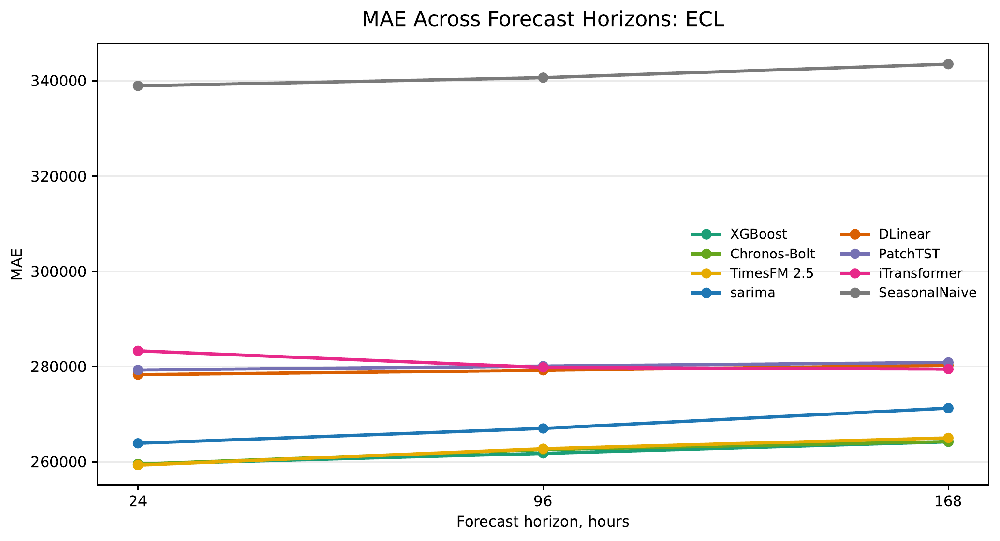
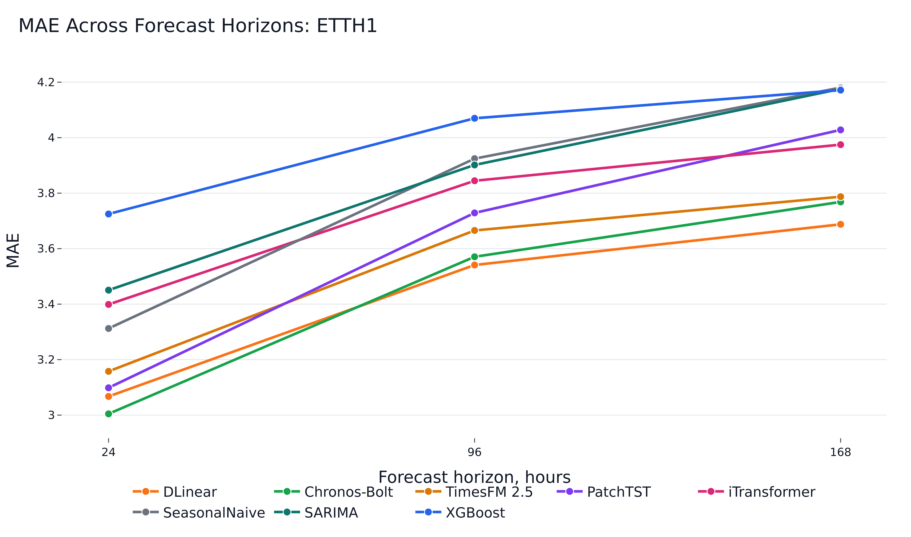
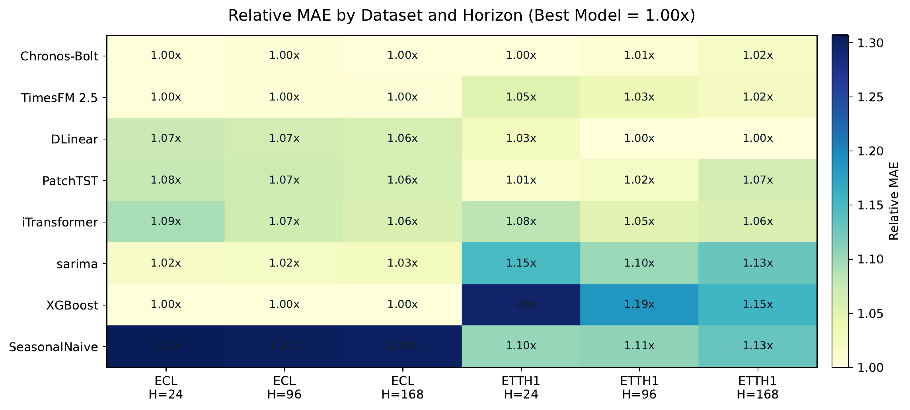
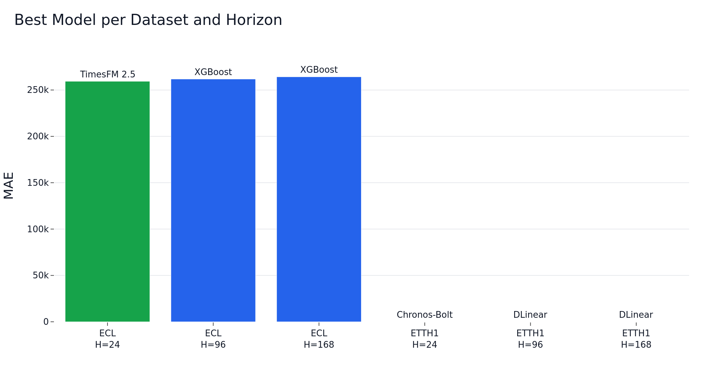
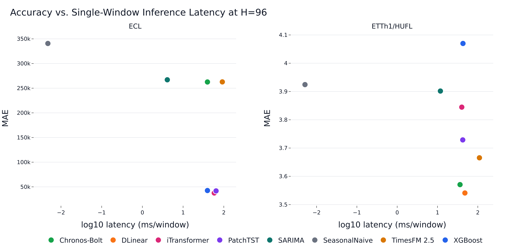

# Аннотация

Краткосрочное прогнозирование электрической нагрузки является ключевым компонентом эксплуатации интеллектуальных энергосетей, опережающего планирования и промышленного энергоменеджмента. В работе представлен воспроизводимый бенчмарк, сравнивающий два классических базовых метода (SeasonalNaive и грид-настроенный SARIMA), модель градиентного бустинга (XGBoost), три нейросетевые архитектуры (DLinear, PatchTST, iTransformer) и две фундаментальные модели временных рядов (Chronos-Bolt-Small и TimesFM 2.5). Основная оценка проводится на наборе ECL по агрегированной нагрузке. ETTh1 используется как вторичный промышленный бенчмарк с целевой переменной HUFL — load-related transformer variable; температура масла OT целенаправленно не рассматривается как электрическая нагрузка. Эксперименты охватывают горизонты 24, 96 и 168 часов при фиксированном контексте 336 часов. На ECL три лидирующие модели — TimesFM, Chronos-Bolt и XGBoost — отличаются друг от друга в пределах примерно 0.1–0.4 % по горизонтам: TimesFM незначительно лучше при H=24, XGBoost — при H=96 и H=168; грид-настроенный SARIMA закрывает большую часть оставшегося разрыва без обучаемых признаков. На ETTh1/HUFL Chronos-Bolt лучшая при H=24, DLinear — при H=96 и H=168. Результаты показывают, что фундаментальные модели конкурентоспособны в zero-shot режиме, но классические и обучаемые на целевом ряду модели остаются сильными при наличии данных и инженерии признаков.

**Ключевые слова:** краткосрочное прогнозирование нагрузки; временные ряды; глубокое обучение; фундаментальные модели; SARIMA; XGBoost; интеллектуальная сеть.

# 1. Введение

Краткосрочное прогнозирование нагрузки (STLF) поддерживает диспетчерское планирование, балансировку, тарифно-ориентированное управление, планирование обслуживания и аномально-чувствительный промышленный энергоменеджмент. В современных задачах smart-grid и Industry 4.0 от моделей прогноза требуется не только точность, но и воспроизводимость, вычислительная экономичность и устойчивость к различным режимам эксплуатации.

Методологический ландшафт широк. Классические методы, такие как ARIMA-семейство и сезонные наивные базовые модели, остаются важными референсами; модели машинного обучения вроде градиентного бустинга привлекательны тем, что включают лаговые и календарные признаки при умеренной инженерии; современные модели глубокого обучения и фундаментальные модели обещают более широкую переносимость между доменами временных рядов. Это порождает практический вопрос: когда дорогие архитектуры или zero-shot фундаментальные модели действительно превосходят сильные недорогие базовые методы?

В работе представлено воспроизводимое исполнение бенчмарка на двух открытых наборах данных. Прагматический вклад состоит в следующем:

- сквозной репозиторий с валидацией данных, leakage-aware шкалированием, метриками, измерением времени, фигурами и сборкой статьи;
- реальные результаты для SeasonalNaive, грид-настроенного SARIMA, XGBoost, DLinear, PatchTST, iTransformer, Chronos-Bolt-Small и TimesFM 2.5;
- тесты Дибольда–Мариано, рассчитанные по поокно-ошибкам для топ-пар моделей;
- анализ accuracy–latency, отделяющий стоимость развёртывания от чистой точности.

{width=6.6in}

# 2. Обзор литературы

Классические методы прогнозирования временных рядов, в частности ARIMA-семейство, остаются важными, потому что задают интерпретируемые и недорогие референсы; автоматический выбор порядков по информационным критериям, таким как AICc, делает их применимыми по отдельным рядам [@hyndman2008automatic]. Подходы машинного обучения на основе лагов, календарных переменных и градиентно-бустированных деревьев широко используются в задачах прогнозирования нагрузки благодаря быстрому обучению и устойчивости при инженерии табличных признаков [@chen2016xgboost].

Модели глубокого обучения, такие как LSTM [@hochreiter1997lstm], архитектуры с механизмом внимания [@vaswani2017attention], Informer [@zhou2021informer], DLinear [@zeng2023dlinear], PatchTST [@nie2023patchtst], iTransformer [@liu2024itransformer], TimesNet [@wu2023timesnet], существенно расширили инструментарий долгосрочного прогнозирования. Фундаментальные модели временных рядов, такие как TimesFM [@das2024timesfm] и семейство Chronos [@ansari2024chronos], мотивируют новую ось оценки: безобучаемое инференс-время против полноценного обучения на целевом наборе.

Корректное сравнение должно учитывать риск того, что открытые бенчмарки могли быть включены в претрейнинговые корпуса. Поэтому zero-shot результаты на ECL или ETT нельзя интерпретировать как гарантированную обобщающую способность на невиданных данных. Узкое и воспроизводимое утверждение в этой работе: Chronos-Bolt и TimesFM запускались без обучения на целевом наборе в рамках данного репозитория.

# 3. Методология

При заданном одномерном контекстном окне задача состоит в предсказании следующих H наблюдений для горизонтов H из множества {24, 96, 168}. Эксперименты используют фиксированную длину контекста L = 336 часов, что включает суточную и недельную сезонные компоненты и допускает использование лага 168.

Базовая модель SeasonalNaive повторяет последний наблюдённый суточный сезонный паттерн. Базовая модель SARIMA использует выбор порядков по AICc на обучающей выборке из фиксированного грида, после чего выбранная модель применяется к тестовым окнам через фильтрацию состояния, без переподгонки на каждом окне. XGBoost обучается как прямой многошаговый регрессор на лагах 1, 24, 168, скользящих средних по 24 и 168 часам и циклических календарных признаках. DLinear, PatchTST и iTransformer обучаются через NeuralForecast в той же одноцелевой постановке, с коротким validation-only перебором learning-rate по 1e-3 и 5e-4 и ранним остановом. Chronos-Bolt-Small и TimesFM 2.5 оцениваются в zero-shot режиме без обучения на целевом ряду.

Все процедуры предобработки для обучаемых моделей подгоняются только на тренировочной части, а метрики считаются после обратного преобразования предсказаний на исходную шкалу целевой переменной. Фундаментальные модели и SARIMA оцениваются непосредственно в исходной шкале.

# 4. Постановка эксперимента

Основной набор данных — ECL, обработанный как агрегированная часовая электрическая нагрузка по 321 клиенту. Вторичный набор — ETTh1, целевая переменная HUFL. Переменная OT в ETTh1 — температура масла и не рассматривается как электрическая нагрузка. ECL разбивается хронологически 70 % train, 10 % validation, 20 % test. ETTh1 использует стандартное хронологическое разбиение 12 / 4 / 4 месяца.

Точность измеряется метриками MAE, RMSE, sMAPE и wMAPE. Эффективность измеряется временем обучения, single-window inference latency (batch size 1), числом обучаемых параметров и пиковым потреблением GPU-памяти. XGBoost, DLinear, PatchTST и iTransformer оцениваются по пяти сидам (42–46) и приводятся как среднее ± СКО. SeasonalNaive, SARIMA, Chronos-Bolt и TimesFM являются single-run детерминированными или zero-shot оценками и приводятся без межсидовой дисперсии.

Тесты Дибольда–Мариано вычисляются по поокно-ошибкам для двух топ-моделей по MAE при сиде 42 для каждой пары (датасет, горизонт). Поскольку усреднение по окнам и плоский поточечный MAE взвешивают ошибки по-разному, ранжирование по статистическим тестам может слегка отличаться от ранжирования таблиц при близких моделях.

# 5. Результаты

{width=6.6in}

## 5.1 Точность на ECL

На ECL сильнейшую группу образуют XGBoost и две фундаментальные модели. TimesFM имеет наименьший поточечный MAE при H=24, но разрыв до XGBoost и Chronos-Bolt — менее 0.1 %, поэтому практическое ранжирование среди этих трёх по сути плоское на коротком горизонте. На H=96 и H=168 незначительно лучше XGBoost, при этом Chronos-Bolt близок на всех трёх горизонтах. Грид-настроенный SARIMA отстаёт от верхней группы на небольшой, но устойчивый разрыв и опережает обучаемые нейросетевые модели.

| Модель | H=24 MAE | H=96 MAE | H=168 MAE |
|---|---:|---:|---:|
| TimesFM 2.5 | **259345.28** | 262766.32 | 265044.60 |
| Chronos-Bolt | 259546.11 | 262601.94 | 264268.27 |
| XGBoost | 259549.38 ± 13.62 | **261792.58 ± 9.36** | **264220.96 ± 24.77** |
| SARIMA | 263913.91 | 267033.48 | 271294.60 |
| DLinear | 278309.93 ± 78.45 | 279227.54 ± 52.48 | 280272.56 ± 47.26 |
| PatchTST | 279295.35 ± 274.56 | 280109.77 ± 94.31 | 280876.20 ± 109.22 |
| iTransformer | 283321.32 ± 278.79 | 279842.21 ± 148.37 | 279476.02 ± 103.81 |
| SeasonalNaive | 338935.90 | 340658.82 | 343510.17 |

{width=6.6in}

## 5.2 Точность на ETTh1/HUFL

На ETTh1/HUFL Chronos-Bolt лучшая при H=24. PatchTST — сильнейшая обучаемая модель на том же горизонте, DLinear лидирует при H=96 и H=168. TimesFM конкурентен, но не лучший на этом бенчмарке. SARIMA близок к лучшему классическому базовому методу и опережает XGBoost на всех трёх горизонтах — обратная ситуация по сравнению с ECL, где XGBoost доминирует над SARIMA.

| Модель | H=24 MAE | H=96 MAE | H=168 MAE |
|---|---:|---:|---:|
| Chronos-Bolt | **3.00** | 3.57 | 3.77 |
| PatchTST | 3.04 ± 0.01 | 3.62 ± 0.03 | 3.95 ± 0.07 |
| DLinear | 3.08 ± 0.00 | **3.55 ± 0.00** | **3.70 ± 0.00** |
| TimesFM 2.5 | 3.16 | 3.67 | 3.79 |
| iTransformer | 3.25 ± 0.02 | 3.72 ± 0.01 | 3.91 ± 0.02 |
| SeasonalNaive | 3.31 | 3.92 | 4.18 |
| SARIMA | 3.45 | 3.90 | 4.18 |
| XGBoost | 3.89 ± 0.01 | 4.21 ± 0.01 | 4.27 ± 0.01 |

{width=6.6in}

## 5.3 Кросс-датасетный взгляд

Нормализованная тепловая карта подчёркивает, что лучшее семейство моделей меняется от датасета и горизонта. На ECL XGBoost и две фундаментальные модели образуют тесную группу. На ETTh1/HUFL Chronos-Bolt и DLinear доминируют на разных горизонтах. Сводка по победителям даёт тот же вывод в более компактной форме.

{width=6.6in}

{width=5.8in}

## 5.4 Эффективность и статистические тесты

Результаты по эффективности отражают компромисс при развёртывании. SeasonalNaive и SARIMA имеют наименьшую inference latency. XGBoost остаётся быстрее нейросетевых моделей и TimesFM и не требует GPU. Chronos-Bolt конкурентен по zero-shot инференсу, тогда как TimesFM имеет наибольшую latency и потребление GPU-памяти в этой реализации.

| Датасет / H=96 | Модель | MAE | Inference мс/окно | GPU МБ |
|---|---|---:|---:|---:|
| ECL | XGBoost | 261792.58 | 25.09 | 0.0 |
| ECL | Chronos-Bolt | 262601.94 | 39.64 | 345.8 |
| ECL | TimesFM 2.5 | 262766.32 | 91.99 | 895.6 |
| ETTh1/HUFL | DLinear | 3.55 | 39.29 | 29.8 |
| ETTh1/HUFL | Chronos-Bolt | 3.57 | 36.24 | 345.8 |
| ETTh1/HUFL | XGBoost | 4.21 | 24.47 | 0.0 |

{width=6.6in}

Тесты Дибольда–Мариано подтверждают, что верхние сравнения не сводятся к небольшим численным различиям в плоском MAE. На ECL результаты при H=96 и H=168 отдают предпочтение XGBoost над Chronos-Bolt. При H=24 TimesFM и XGBoost практически идентичны в операционном смысле, хотя тест отвергает гипотезу равной точности. На ETTh1/HUFL тесты подтверждают Chronos-Bolt при H=24 и DLinear на двух более длинных горизонтах.

| Датасет / Горизонт | Сравнение | Статистика | p-value | Значимо |
|---|---|---:|---:|---|
| ECL / H=24 | TimesFM vs XGBoost | 13.45 | <0.001 | Да |
| ECL / H=96 | XGBoost vs Chronos-Bolt | -38.15 | <0.001 | Да |
| ECL / H=168 | XGBoost vs Chronos-Bolt | -2.88 | 0.004 | Да |
| ETTh1 / H=24 | Chronos-Bolt vs PatchTST | -3.39 | <0.001 | Да |
| ETTh1 / H=96 | DLinear vs Chronos-Bolt | -2.48 | 0.013 | Да |
| ETTh1 / H=168 | DLinear vs Chronos-Bolt | -8.81 | <0.001 | Да |

# 6. Обсуждение

Результаты показывают, что выбор модели зависит от датасета. На агрегированной нагрузке ECL инженерия лагов в комбинации с XGBoost остаётся крайне сильным и недорогим решением. Грид-настроенный SARIMA также конкурентен и опережает обучаемые нейросетевые архитектуры в этом сравнении. Фундаментальные модели привлекательны, когда отказ от обучения на целевом ряду имеет ценность: Chronos-Bolt близок к XGBoost на ECL и лучший на коротком горизонте ETTh1/HUFL. DLinear — сильнейшая обучаемая нейросетевая модель в этом бенчмарке и доминирует на длинных горизонтах ETTh1/HUFL.

С точки зрения развёртывания модели занимают разные операционные режимы. XGBoost — наиболее привлекательный выбор при допустимости стандартного supervised-пайплайна: точен на ECL, имеет малую single-window latency, не требует GPU. SARIMA — конкурентный недорогой запасной вариант без обучаемых признаков и с миллисекундной инференсной задержкой. Chronos-Bolt полезен, когда обучение на целевом ряду нежелательно, например в сценариях cold-start промышленного мониторинга, быстрой прототипизации или когда данные нельзя объединять для обучения. TimesFM показывает сильную точечную точность на коротком горизонте ECL, но имеет существенно более высокую latency в этой реализации.

Результаты трансформеров стоит читать осторожно. PatchTST и iTransformer — содержательные архитектуры, однако данный бенчмарк использует компактную одноцелевую конфигурацию и фиксированный бюджет обучения. Их относительная слабость здесь не означает общей непригодности трансформеров для прогноза нагрузки; она лишь показывает, что они не превосходят более простые методы автоматически в условиях ограниченного и воспроизводимого протокола.

# 7. Ограничения

Основные ограничения связаны с риском контаминации фундаментальных моделей при претрейне на открытых бенчмарках, ограниченным перебором гиперпараметров, одноцелевым моделированием и отсутствием закрытых промышленных данных развёртывания. Скользящий AutoARIMA как базовая модель пробовался, но полный per-origin grid search оказался непомерно дорогим в этом протоколе. Частичный запуск сохранён в логах репозитория, но исключён из основных таблиц сравнения. Грид-настроенный SARIMA в этой работе — практическая замена: порядки выбираются на тренировочной выборке по AICc, и параметры повторно используются для окон прогноза, давая быстрый и чётко определённый ARIMA-базовый метод.

Chronos-Bolt также выдаёт предупреждение о том, что длины прогноза свыше 64 находятся вне рекомендованного диапазона. Поэтому результаты Chronos при H=96 и H=168 следует интерпретировать как практический стресс-тест, а не оптимальное использование модели. Результаты фундаментальных моделей не следует чрезмерно интерпретировать как гарантированную zero-shot обобщающую способность на невиданных данных. ECL и ETT — открытые бенчмарки, и они могут пересекаться с претрейнинговыми или оценочными корпусами, использовавшимися при разработке этих моделей.

# 8. Заключение

Построен и исполнен воспроизводимый пайплайн STLF-бенчмарка на ECL и ETTh1/HUFL. На ECL XGBoost, Chronos-Bolt и TimesFM операционно близки друг к другу по горизонтам: TimesFM лучший при H=24, XGBoost — при H=96 и H=168. На ETTh1/HUFL Chronos-Bolt лидирует при H=24, PatchTST — лучшая обучаемая модель на H=24, DLinear — при H=96 и H=168. Эти выводы поддерживают прагматичную рекомендацию: сравнивайте сначала с сильными простыми базовыми методами, используйте DLinear и PatchTST как нейросетевые референсы, а фундаментальные модели рассматривайте как ценный инструмент для cold-start, а не как универсально доминирующую замену supervised-прогнозированию.

# Литература
